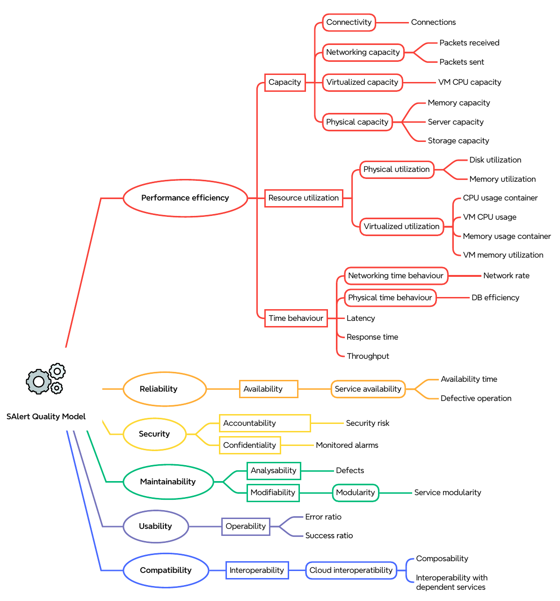
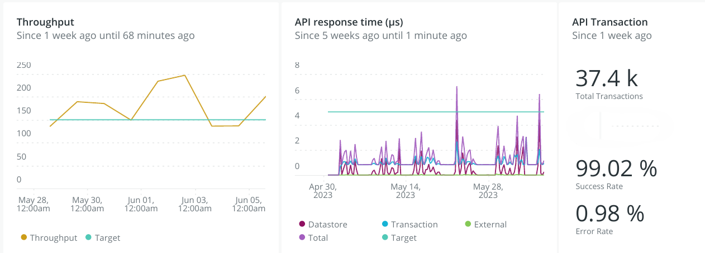

# A product quality model for cloud services

# Welcome {#inicio}
You can find relevant information on this site attached to the article the **_A product quality model for cloud services_**. 
The **_product quality model_** and the **_case study_** are detailed in the following sections.

## Index

**A. Quality model for cloud services**
1. [Quality model metamodel](#metamodel)
2. [Method](#method)
3. [Building the quality model](#building)
4. [Quality model for cloud services](#model)

**B. Case study**

## A. Quality model metamodel {#metamodel}
The quality model proposes the ISO/IEC 25010 standard as the baseline extends and decomposes into sub-characteristics adjusted to the domain, determines objectively measurable attributes, and specifies metrics for the attributes. 

<a href ="./images/modelo.png"> Figure 1 </a> provides a clear and structured representation of the metamodel of the quality model and its metaclasses that describe the relationships among cloud domain and quality model concepts.

 Figure 1. <a href ="./images/modelo.png"> Metamodel of the quality model </a>  
    

Defining metamodel main concepts:
- Characteristics are non-measurable aspects that are used in the quality model to categorize a high-level aspect that can be
evaluated.
- Subcharacteristics specify the aspects to be evaluated but are not objectively measurable and are broken down into quality
attributes. These are contained in the characteristic metaclass with the relationship to itself.
- Attributes are objectively measurable quality aspects (i.e., physical, abstract) that are not further decomposed and can be
measured using metrics.
- Metrics define a possible way to measure an attribute. It provides a measurement scale (i.e., nominal, ordinal, interval,
ratio, or absolute) combined with a measurement approach (i.e., measurement method or measurement function)
- Operationalization is the core of the metamodel, which establishes a mapping between the generic definition of a metric and
 the artifact or cloud platform where the metric is measured. 

## 2. Method {#method}

Our proposal is a quality model for cloud services that meets the conditions for a mixed approach and has been defined based on these two resources. 
On the one hand, the quality model proposed by the ISO/IEC 25010 standard, defines the system and software quality characteristics and subcharacteristics at a high level of abstraction. The issue with this standard is that it provides a generic model that needs to be adapted to the specific context or domain of cloud services. 

On the other hand, a taxonomy of metrics for evaluating cloud services was obtained through an SLR [3]. The process followed in the SLR contains three main phases: planning to define the review protocol, conducting to collect data, and reporting to communicate and report the results. In addition, the taxonomy creation
process detailed the activities with their artifacts, inputs, and outputs for each.
As a result, 243 attributes, 407 metrics, and 468 operationalizations were obtained.

Figure 2. <a href ="./images/Figure2.pdf">Attributes, metric, operationalizations </a>   

## 3. Building quality model {#building}
The hierarchical decomposition of the quality model was performed using thematic analysis. This method provides a rigorous and systematic way to process qualitative information by identifying, analyzing, and eliciting patterns (themes) within the data collected [42].
Figure 3 shows the process carried out collaboratively by the team of authors, in working meetings, and consisted of the following steps:

Figure 3. <a href ="./images/Figure3.pdf">Process for decomposition of the quality model </a>   

1. Coding: we read the selected primary studies and identified the text segments that refer to quality characteristics, quality attributes, and metrics. Then, the text segments containing relevant information were coded using a labeling system developed by the authors. Mendeley has been used as a support tool.
2. Transforming codes into themes: the codes obtained were analyzed to compare them and classify them into categories
to combine them into potential themes. This process has been performed iteratively for each attribute and metric.
3. Reviewing and refining themes: the themes obtained have been reviewed and compared to detect coincidences/repetitions.
The quality attributes, the metrics, and the cloud artifacts (where the metrics are applied) were compared with each other
to understand the themes. The result was a set of themes related to quality characteristics, quality attributes, and metrics.
 

## 4. Quality model for cloud services {#model}
The model is organized hierarchically, from characteristics and subcharacteristics to attributes, metrics, and operationalizations. 
The proposed cloud services quality model is an adaptation and extension of the ISO/IEC 25010 SQuaRE standard to suit the cloud services domain. The process involved examining the eight characteristics of this standard and the 406 metrics from Guerron et al. [3]. The analysis and decomposition process resulted in 68 subcharacteristics that expand the subcharacteristics of the standard and 240 related attributes, which were used to build the hierarchical decomposition of the quality model. Figure 4 shows the model diagram down to the level of characteristics and subcharacteristics, including existing and adding new ones.

Figure 4.<a href ="./images/Figure4.pdf">Cloud service quality characteristics and subcharacteristics</a>   

  

### Instrucctions to **PowerBI Quality Model for Cloud Services**   

 - Download **PowerBI file** on Local
 <a href ="./files/modelv3.pbix"> Quality Model for Cloud Services </a>   
 - Open <a href = "https://www.microsoft.com/en-us/power-platform/products/power-bi/downloads"> Power BI application on cloud </a>   
 - Open **My wokspace**
 - Import **Report, Paginated Report or Workbook**
 - Seleect **From this computer** search the local file

 For more details see the **Demo Video**

 <video width="640" height="360" controls>
  <source src="./files/demo.mp4" type="video/mp4">
  Your browser does not support the video tag.
</video>

<!--[Watch the video]<a href = "https://github.com/ximeguerron/qualityModel/files/demo.mp4" target="_blank">**Demo **</a> Download and play the Demo PowerBI Project

Link to **Excel** file <a href ="https://support.office.com/en-us/article/Start-the-Power-Pivot-add-in-for-Excel-a891a66d-36e3-43fc-81e8-fc4798f39ea8"> How to enable Excel complements

NOTE: In order to visualize the reports, please enable de _Power Pivot_ and _Power View_ complements of Excel. -->

# B. Case study
The objective of the case study was to demonstrate the feasibility of operationalizing the proposed quality model to assess cloud services (e.g., databases, applications, microservices).

The unit of analysis consisted of a single case SaaS called “Social Alert” (SAlert) running in a test operational environment. It is a real case of SaaS in the industry, a data science system applied to network analytics content-based. 

Figure 6 shows the decomposition of quality characteristics into sub-characteristics, quality attributes, and metrics for the case study. 

 Figure 6.<a href ="./images/Figure6.pdf">SaaS Salert Quality Model</a>   

We used a third-party tool called New Relic [38] to perform the measurements by gathering low-level raw data from the components of the SaaS, calculating others’ metrics, and resulting in values on the measurement scales
We present the graphical representation of some measurement results performed during a period of time for some specific metrics, and we separate them into different dashboard groupings by layers of component monitoring (e.g., host, PostgreSQL, containers, API).

<a href ="./images/Figure9.pdf"> Figure 7 </a> reports the monitored SaaS API using the throughput, response time, success, and error rate measurements.

 Figure 7.<a href ="./images/Figure9.pdf">SaaS monitor </a> <be> 

<a href ="./images/Figure8.a.pdf"> Figure 8.a </a>, reports the PaaS PostgreSQL instance's current state we monitored the connections, commits, and the DB operations rate as new metrics. 

Regarding the  <a href ="./images/Figure8.b.pdf"> Figure 8.b </a> PaaS containers, we represented the memory usage, and packets received and sent. Resources are shared
among all the containers.

 Figure 8.a.<a href ="./images/Figure8.a.pdf">PaaS DB Instance monitor</a>   

 Figure 8.b.<a href ="./images/Figure8.b.pdf">PaaS Container monitor</a> <be> 

<a href ="./images/Figure7.pdf"> Figure 9 </a>, reports the current IaaS state with the usage of CPU, memory, and storage measurements.

  Figure 9.<a href ="./images/Figure7.pdf">IaaS monitor </a>   

  
<!--The tool monitor setting and   
 1. <a href ="https://onenr.io/02wdKxE1XQE"> IaaS monitor </a>  -->
  

## Support or Contact 

Have trouble with Pages or any questions or suggestions? Please, contact us by email 
